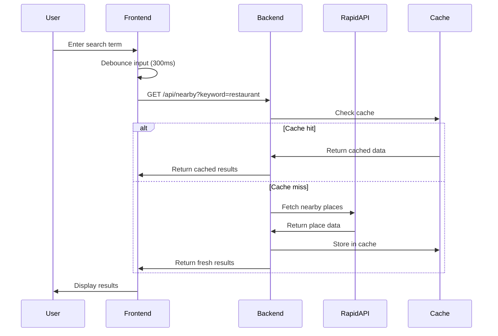
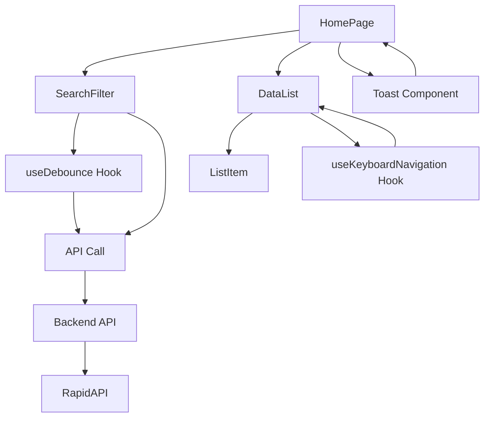

# Architecture Documentation

## System Overview

Local Data Lister is a full-stack web application that provides users with information about nearby places (restaurants, parks, events) based on their location. The system follows a modern client-server architecture with clear separation of concerns.

## Architecture Diagram

```
┌─────────────────┐    HTTP/HTTPS    ┌─────────────────┐
│                 │◄────────────────►│                 │
│   Frontend      │                  │    Backend      │
│   (React)       │                  │   (Express.js)  │
│                 │                  │                 │
└─────────────────┘                  └─────────────────┘
         │                                     │
         │                                     │
         ▼                                     ▼
┌─────────────────┐                  ┌─────────────────┐
│                 │                  │                 │
│   Browser       │                  │   RapidAPI      │
│   Storage       │                  │   (External)    │
│                 │                  │                 │
└─────────────────┘                  └─────────────────┘
```

## Component Architecture

### Frontend Architecture

```
┌─────────────────────────────────────────────────────────────┐
│                    React Application                        │
├─────────────────────────────────────────────────────────────┤
│  ┌─────────────┐  ┌─────────────┐  ┌─────────────┐         │
│  │   Pages     │  │ Components  │  │   Hooks     │         │
│  │             │  │             │  │             │         │
│  │ • HomePage  │  │ • Search    │  │ • useDebounce│         │
│  │ • About     │  │ • DataList  │  │ • useUser   │         │
│  │ • Contact   │  │ • ListItem  │  │ • useApi    │         │
│  └─────────────┘  └─────────────┘  └─────────────┘         │
├─────────────────────────────────────────────────────────────┤
│  ┌─────────────┐  ┌─────────────┐  ┌─────────────┐         │
│  │   Services  │  │   Utils     │  │   Types     │         │
│  │             │  │             │  │             │         │
│  │ • ApiClient │  │ • Validation│  │ • Interfaces│         │
│  │ • Auth      │  │ • Formatting│  │ • Enums     │         │
│  │ • Cache     │  │ • Helpers   │  │ • Types     │         │
│  └─────────────┘  └─────────────┘  └─────────────┘         │
└─────────────────────────────────────────────────────────────┘
```

### Backend Architecture

```
┌─────────────────────────────────────────────────────────────┐
│                   Express.js Server                         │
├─────────────────────────────────────────────────────────────┤
│  ┌─────────────┐  ┌─────────────┐  ┌─────────────┐         │
│  │   Routes    │  │ Middleware  │  │   Services  │         │
│  │             │  │             │  │             │         │
│  │ • /api/nearby│  │ • CORS      │  │ • ApiService│         │
│  │ • /api/health│  │ • Auth      │  │ • Cache     │         │
│  │ • /api/docs │  │ • Validation│  │ • Logger    │         │
│  └─────────────┘  └─────────────┘  └─────────────┘         │
├─────────────────────────────────────────────────────────────┤
│  ┌─────────────┐  ┌─────────────┐  ┌─────────────┐         │
│  │   Models    │  │   Utils     │  │   Config    │         │
│  │             │  │             │  │             │         │
│  │ • DataItem  │  │ • Validation│  │ • Database  │         │
│  │ • User      │  │ • Formatting│  │ • API Keys  │         │
│  │ • Cache     │  │ • Helpers   │  │ • Environment│         │
│  └─────────────┘  └─────────────┘  └─────────────┘         │
└─────────────────────────────────────────────────────────────┘
```

## Data Flow

### Search Flow



### Component Interaction



## Technology Stack

### Frontend

- **Framework**: React 19.1.0 with TypeScript
- **Build Tool**: Vite 6.3.5
- **Testing**: Vitest + React Testing Library
- **Styling**: CSS with CSS Variables
- **State Management**: React Hooks + Context
- **HTTP Client**: Fetch API

### Backend

- **Runtime**: Node.js with TypeScript
- **Framework**: Express.js 5.1.0
- **Testing**: Jest + Supertest
- **Logging**: Winston
- **Validation**: Zod
- **HTTP Client**: node-fetch

### External Services

- **API Provider**: RapidAPI (Search Nearby Places)
- **Geolocation**: Browser Geolocation API

## Security Architecture

### Authentication & Authorization

```
┌─────────────────┐    JWT Token    ┌─────────────────┐
│                 │◄───────────────►│                 │
│   Frontend      │                  │   Backend       │
│                 │                  │                 │
│ • Token Storage │                  │ • Token Verify  │
│ • Auth Context  │                  │ • Role Check    │
│ • Route Guard   │                  │ • Permission    │
└─────────────────┘                  └─────────────────┘
```

### Data Protection

- **API Keys**: Stored in environment variables
- **HTTPS**: Required for production
- **CORS**: Configured for security
- **Input Validation**: Zod schema validation
- **Rate Limiting**: API call throttling

## Performance Architecture

### Caching Strategy

```
┌─────────────────┐
│   Frontend      │
│   Cache         │
│                 │
│ • Search Results│
│ • User Data     │
│ • UI State      │
└─────────────────┘
         │
         ▼
┌─────────────────┐
│   Backend       │
│   Cache         │
│                 │
│ • API Responses │
│ • User Sessions │
│ • Rate Limits   │
└─────────────────┘
```

### Optimization Techniques

- **Debouncing**: Search input optimization
- **Memoization**: React component optimization
- **Virtualization**: Large list rendering
- **Lazy Loading**: Component and route loading
- **Code Splitting**: Bundle optimization

## Deployment Architecture

### Development Environment

```
┌─────────────────┐    ┌─────────────────┐
│   Frontend      │    │   Backend       │
│   (Port 5173)   │    │   (Port 3001)   │
│                 │    │                 │
│ • Hot Reload    │    │ • Auto Restart  │
│ • Dev Tools     │    │ • Debug Mode    │
│ • Source Maps   │    │ • Logging       │
└─────────────────┘    └─────────────────┘
```

### Production Environment

```
┌─────────────────┐    ┌─────────────────┐
│   CDN/Static    │    │   Application   │
│   Hosting       │    │   Server        │
│                 │    │                 │
│ • React Build   │    │ • Express.js    │
│ • Static Assets │    │ • API Endpoints │
│ • Caching       │    │ • Load Balancer │
└─────────────────┘    └─────────────────┘
```

## Scalability Considerations

### Horizontal Scaling

- **Load Balancing**: Multiple server instances
- **Database**: Connection pooling
- **Caching**: Redis for distributed caching
- **CDN**: Static asset delivery

### Vertical Scaling

- **Memory**: Optimize memory usage
- **CPU**: Efficient algorithms
- **Storage**: Optimize data storage
- **Network**: Minimize API calls

## Monitoring & Logging

### Application Monitoring

```
┌─────────────────┐    ┌─────────────────┐
│   Frontend      │    │   Backend       │
│   Monitoring    │    │   Monitoring    │
│                 │    │                 │
│ • Error Tracking│    │ • Request Logs  │
│ • Performance   │    │ • Error Logs    │
│ • User Analytics│    │ • Metrics       │
└─────────────────┘    └─────────────────┘
```

### Logging Strategy

- **Structured Logging**: JSON format
- **Log Levels**: Error, Warn, Info, Debug
- **Log Rotation**: File size and time-based
- **Centralized Logging**: Aggregated logs

## Error Handling

### Error Flow

```
┌─────────────────┐    ┌─────────────────┐    ┌─────────────────┐
│   Frontend      │    │   Backend       │    │   External API  │
│   Error         │    │   Error         │    │   Error         │
│   Handling      │    │   Handling      │    │   Handling      │
│                 │    │                 │    │                 │
│ • User Feedback │    │ • Error Logging │    │ • Retry Logic   │
│ • Fallback UI   │    │ • Status Codes  │    │ • Circuit Breaker│
│ • Error Boundary│    │ • Error Response│    │ • Timeout       │
└─────────────────┘    └─────────────────┘    └─────────────────┘
```

## Future Architecture Considerations

### Microservices Migration

- **API Gateway**: Centralized routing
- **Service Discovery**: Dynamic service registration
- **Message Queue**: Asynchronous communication
- **Distributed Tracing**: Request tracking

### Cloud Native

- **Containerization**: Docker containers
- **Orchestration**: Kubernetes
- **Serverless**: AWS Lambda / Azure Functions
- **Managed Services**: Database, caching, monitoring

## Conclusion

The Local Data Lister architecture follows modern web development best practices with:

- **Separation of Concerns**: Clear frontend/backend separation
- **Scalability**: Designed for growth and performance
- **Security**: Multiple layers of protection
- **Maintainability**: Clean code structure and documentation
- **Monitoring**: Comprehensive logging and error handling

This architecture provides a solid foundation for current needs and future expansion.
